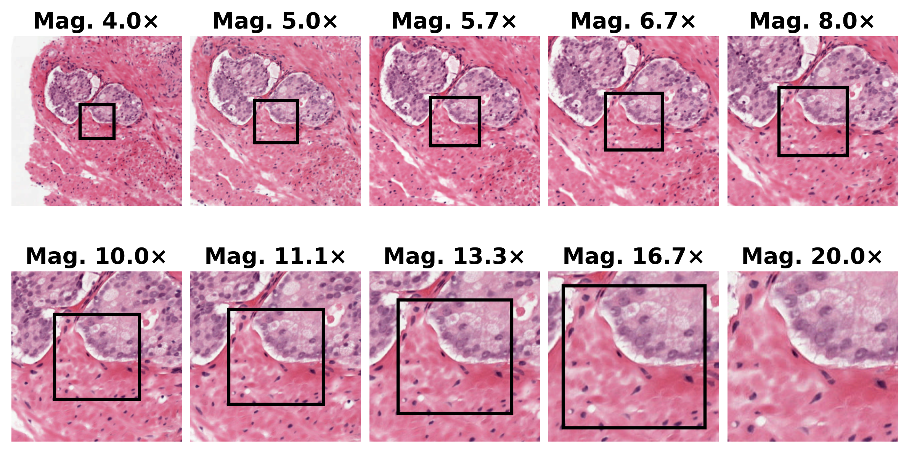
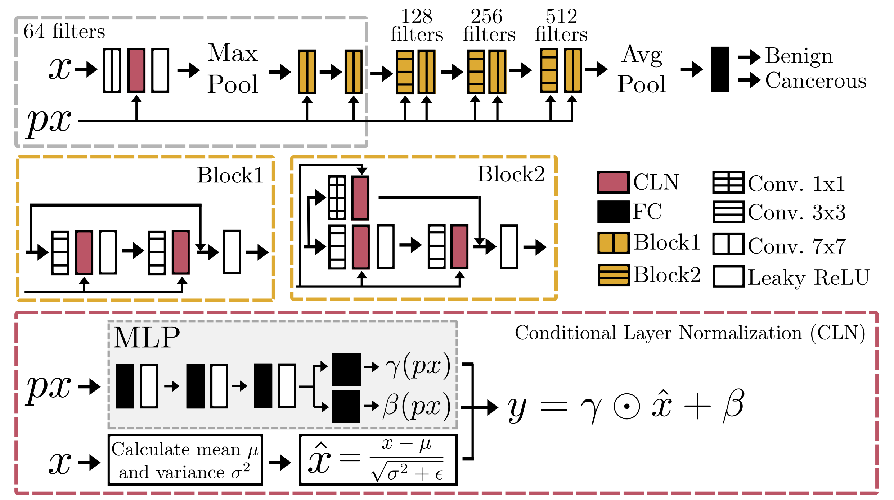
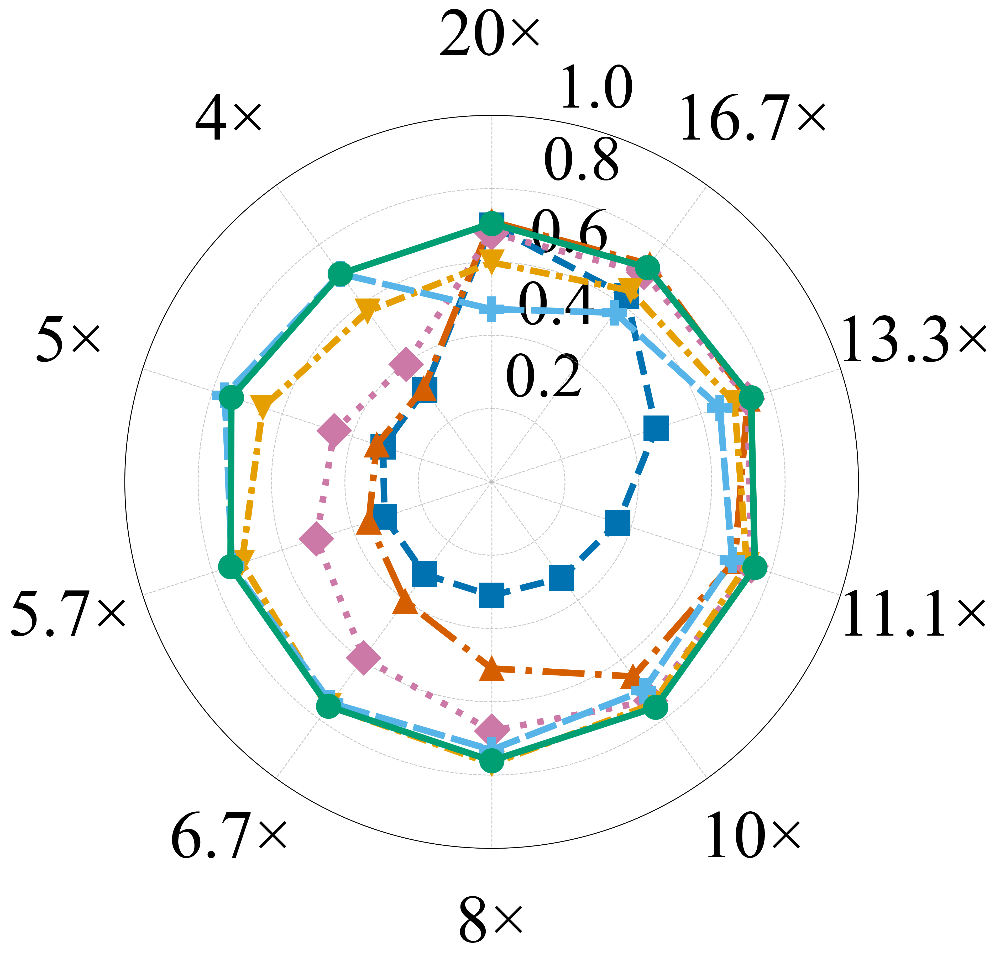
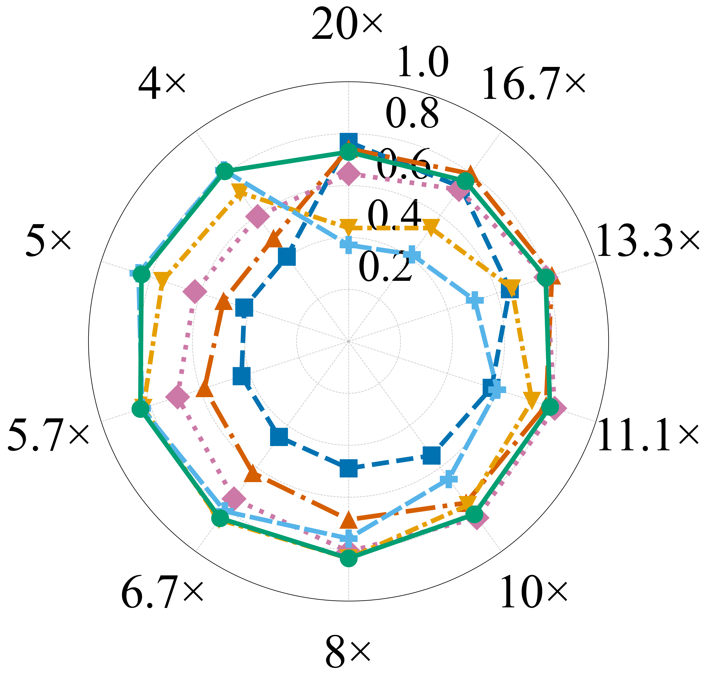

# One Model to Magnify Them All: Efficient Scale-Invariant Histopathology via Conditional Normalization and Continuous Magnification Training

## Description
A deep learning framework for whole slide image (WSI) analysis in histopathology. Whole slide images are acquired at discrete magnification levels, and models trained at a fixed magnification degrade when applied to scales they have not seen. This repository provides the implementation of **Conditional Layer Normalization (CLN)** combined with **continuous magnification training**, integrated into standard ResNet and U-Net architectures for WSI classification and segmentation, and validated on the PANDA prostate cancer dataset.

## The Problem

Histopathological diagnosis inherently requires reasoning across spatial scales: low-magnification views reveal tissue architecture and glandular organization, while high-magnification fields expose cellular morphology and nuclear atypia (Fig. 1). Existing approaches to this multi-scale nature achieve robustness at a steep efficiency cost - multi-scale architectures, dedicated per-magnification branches, or hierarchical/foundation models remain bound to a predefined, discrete set of resolutions. In clinical deployment, acquisition magnification varies continuously, rarely aligns with a model's fixed training resolution, and intermediate scales are common. Covering the full range therefore forces a costly ensemble of magnification-specific models, and none of these approaches provide a mechanism to handle arbitrary, previously unseen intermediate resolutions.

<p align="center">
  
</p>

<p align="center"><em>Fig. 1 - Multi-scale histopathological view of a prostate biopsy specimen at magnifications ranging from 20× to 4×, illustrating the progressive transition from cellular detail to overall glandular architecture (PANDA dataset).</em></p>

## Method

We address these limitations with **Conditional Layer Normalization (CLN)**, a lightweight normalization layer that dynamically modulates internal feature representations as a function of input pixel size, integrated into standard ResNet and U-Net architectures for classification and segmentation, respectively - without otherwise modifying the network. Models are trained on patches sampled continuously across a range of pixel sizes (**continuous magnification training**), exposing the network to a continuum of resolutions rather than a discrete set. This is the key departure from prior work: it enables robust generalization to arbitrary, previously unseen magnification levels at inference time, without multi-scale input representations or model ensembles. This collapses a five-model ensemble into one network and reduces training and inference cost roughly 4-5× with no increase in multiply-accumulate operations.

### Conditional Layer Normalization (CLN)

Standard layer normalization applies fixed, learned affine parameters $\gamma$ and $\beta$ to normalized features, independent of the acquisition context. CLN replaces this with scale $\gamma$ and shift $\beta$ parameters generated dynamically from the input pixel size $px \in \mathbb{R}^2$ via a lightweight multilayer perceptron:

$$\text{CLN}(x; px) = \gamma(px) \odot \hat{x} + \beta(px), \quad \hat{x} = \frac{x - \mu}{\sqrt{\sigma^2 + \epsilon}}$$

where $x$ is the input feature map, $\mu$ and $\sigma^2$ are its mean and variance, $\epsilon = 1\times10^{-5}$, and $\gamma(px)$, $\beta(px)$ are predicted by independent three-layer MLPs with LeakyReLU activations, one per normalization layer.

<p align="center">
  
</p>

<p align="center"><em>Fig. 2 - CLN architecture and its integration into ResNet. The MLP maps input pixel size px to affine parameters γ(px) and β(px), which modulate normalized feature maps computed from the patch input, producing the conditioned output. In U-Net, CLN is applied analogously at each encoder and decoder stage.</em></p>

- **Pixel size, not magnification, as the conditioning signal.** Pixel size (µm/pixel) is a physical, hardware-independent quantity, unlike scanner-dependent magnification, which is what lets the conditioning generalize across scanners and magnifications.
- **Capacity scales with the layer.** The conditioning MLP's hidden width at each stage matches the feature dimensionality of the corresponding normalization layer.
- **Identity at initialization.** Output projections are initialized to produce $\gamma=1$, $\beta=0$, so CLN is equivalent to standard layer norm at initialization and only deviates as scale-dependent adaptation emerges during training.
- **Drop-in replacement.** No other architectural change is required; CLN is applied at every resolution stage of both the ResNet encoder (classification) and the U-Net encoder-decoder (segmentation).

### Continuous Magnification Training

Rather than training at a discrete set of magnifications, patch pixel size is sampled uniformly from a continuous range at every training iteration instead of a fixed set of scanner presets. This exposes the model to a dense continuum of resolutions, preventing overfitting to discrete scanner-specific scales and enabling generalization to intermediate magnifications never encountered during training. At inference, the model accepts any pixel size, decoupling deployment from the acquisition hardware. Combined with CLN conditioning, this is the core mechanism behind the model's scale invariance.

Implementation (`src/datasets/training_dataset.py`): the `TrainingDataset` draws a **new pixel size independently for every patch** - when `pixel_size=None`, each `__getitem__` call samples `px ~ Uniform(min_pixel_size, max_pixel_size)` and extracts the patch at that resolution, rather than a fixed value shared across a batch or epoch. This sampled pixel size is passed alongside the patch as the conditioning signal `px` consumed by CLN.

- Range defaults (`src/datasets/config.py`): `MIN_PIXEL_SIZE = 0.50`, `MAX_PIXEL_SIZE = 2.00` µm/pixel (matching the PANDA dataset's native resolution range), overridable per training run via `--min_pixel_size` / `--max_pixel_size`.
- Passing a fixed `--pixel_size` (as in the `*_base.py` scripts) disables sampling and reproduces the single-magnification baseline behavior instead.
- Patch validity is resolution-aware: the minimum required fraction of foreground/target pixels for a patch to be accepted is relaxed at coarser pixel sizes (`_PATCH_VALIDITY_CONFIG`), since a fixed-size patch covers proportionally more tissue context as pixel size increases.

The framework also includes data loading/preprocessing, training pipelines, and evaluation tools optimized for large-scale WSI processing.

### Results

On the PANDA prostate cancer dataset, five single-magnification baselines (trained independently at 20×, 13.3×, 10×, 6.7×, 5×) were compared against one CLN-conditioned model trained continuously across the same range, with all models evaluated at both seen and unseen intermediate magnifications. The single CLN-conditioned model on average matches or exceeds the independently trained single-magnification baselines on both classification and segmentation, and ranks among the top three models at every evaluated magnification - whereas each single-magnification baseline only ranks highest near its own training magnification and degrades substantially elsewhere.

<table align="center">
  <tr>
    <td align="center"><br><strong>(a)</strong></td>
    <td align="center"><br><strong>(b)</strong></td>
  </tr>
</table>
<p align="center">
  
</p>

<p align="center"><em>Fig. 4 - Model performance with respect to the magnification level on the PANDA prostate biopsies, for (a) ResNet classification (F1 score) and (b) U-Net segmentation (Dice score). Each plot compares models trained at specific magnifications and evaluated across multiple inference magnifications.</em></p>

## Project Structure

```
├── src/
│   ├── csv_loaders/               # CSV data loading utilities
│   ├── datasets/                  # Dataset implementations and PyTorch Lightning data module
│   │   └── single_wsi_dataset/    # WSI-specific dataset handlers (fixed / continuous pixel size)
│   ├── evaluation/
│   │   ├── resnet/                # ResNet evaluation scripts
│   │   ├── unet/                  # U-Net evaluation scripts
│   │   └── utils/                 # Evaluators
│   ├── experiments/                # Training entry points
│   │   ├── resnet/                # base / continuous-pixel-size / CLN variants
│   │   └── unet/                  # base / continuous-pixel-size / CLN variants
│   ├── networks/                  # Neural network architectures
│   │   ├── resnet/                # ResNet18/34/50/101/152 + CLN variant
│   │   └── unet/                  # U-Net + CLN variant
│   ├── parsers/                   # Dataset parsing (PANDA, Camelyon) and tissue-mask utilities
│   ├── paths/                     # Path configuration (paths.py)
│   ├── training/                  # Training loop, timing callback
│   └── utils/                     # Seeding/reproducibility, loading and other utilities
├── figures/                       # Paper figures (.png)
├── requirements.txt               # Python dependencies (excluding PyTorch)
├── setup.py                       # Package setup configuration
├── LICENSE.md                     # License text
└── README.md                      # This file
```

## Installation and Environment Setup

```bash
# 1. Create and activate an environment (conda shown; venv works the same way)
conda create -n env python=3.10.4
conda activate env

# 2. Install PyTorch separately, matching your CUDA version (check with `nvidia-smi`).
#    Example for CUDA 12.4 - see https://pytorch.org/get-started/previous-versions/ for others.
conda install pytorch==2.4.0 torchvision==0.19.0 torchaudio==2.4.0 pytorch-cuda=12.4 -c pytorch -c nvidia

# 3. Install the remaining dependencies and the package itself (editable mode)
pip install -r requirements.txt
pip install -e .

# 4. Install the required augmentation library
git clone https://github.com/Jarartur/HistopathologyAugmentationResearch.git
pip install -e HistopathologyAugmentationResearch
pip install -e HistopathologyAugmentationResearch[HISTSEG]
```

Set the paths in `src/paths/paths.py` (`DATA_DIR`, `OUTPUTS_MODELS`, `OUTPUTS_EVALUATION`, and, on Windows, `OPENSLIDE_BIN_DIR`) before running any script.

## Usage

### Training

Each architecture (`src/experiments/resnet/`, `src/experiments/unet/`) provides two training entry points, corresponding to the models compared in the paper:

| Script | Variant | Pixel size during training |
|---|---|---|
| `train_{resnet,unet}_base.py` | Standard architecture, single-magnification baseline | Fixed, given via `--pixel_size` |
| `train_{resnet,unet}_conditional_norm_all_px.py` | **Conditional Layer Normalization (CLN)** - the paper's main model | Sampled continuously from `[--min_pixel_size, --max_pixel_size]` |

Common arguments across all scripts:
- `--fold` - data split/fold identifier
- `--unique_name` - suffix appended to the output/checkpoint folder name
- `--checkpoint_path` - optional checkpoint to resume from
- `--min_pixel_size` / `--max_pixel_size` - override the default continuous pixel-size sampling range (all-px variants only) or `--pixel_size` for the fixed-magnification baseline
- `--remove_BG` - exclude the background class from classification targets (ResNet only)
- `--seed` (default `2024`), `--num_workers` (default `9`), `--deterministic` (`true`/`warn`/`false`) - reproducibility controls shared by every script

Example - training the CLN-conditioned ResNet classifier:
```bash
python src/experiments/resnet/train_resnet_conditional_norm_all_px.py \
  --fold 0 \
  --unique_name my_experiment \
  --remove_BG 1
```

### Evaluation / Inference

Run a trained checkpoint against a chosen test-time pixel size. Raw per-patch predictions are saved under `OUTPUTS_EVALUATION/EVALUATION/`.

```bash
python src/evaluation/resnet/run_evaluate_resnet.py \
  --model_type resnet18 \
  --model_checkpoint_path /path/to/checkpoint.ckpt \
  --trained_pixel_size 0.5 \        # or "None" for pixel-agnostic (CLN) models
  --tested_pixel_size 0.5 \
  --unique_name my_experiment
```
Supported `--model_type` values: `resnet18`, `resnetCN18`.

```bash
python src/evaluation/unet/run_evaluate_unet.py \
  --model_type unetCN \
  --model_checkpoint_path /path/to/checkpoint.ckpt \
  --trained_pixel_size None \        # or a float for fixed pixel-size models
  --tested_pixel_size 0.5 \
  --unique_name my_experiment
```
Supported `--model_type` values: `unet`, `unetCN`.

Output goes to `OUTPUTS_EVALUATION/EVALUATION/<model_type>_trained_PS_<ps>_<unique_name>/`. Run once per checkpoint × tested pixel size to reproduce cross-magnification evaluation.

## Citation

If you use this code, please cite the associated paper:

```bibtex
```

## License

This project is licensed under the [Creative Commons Attribution-NonCommercial-ShareAlike 4.0 International (CC BY-NC-SA 4.0)](https://creativecommons.org/licenses/by-nc-sa/4.0/legalcode.en) license. See [`LICENSE.md`](LICENSE.md) for the full text.

## Acknowledgments

This project has received funding from the European Union's Horizon 2020 research and innovation programme under grant agreement No 857533 and from the International Research Agendas Programme of the Foundation for Polish Science No MAB PLUS/2019/13. The publication was created within the project of the Minister of Science and Higher Education "Support for the activity of Centers of Excellence established in Poland under Horizon 2020" on the basis of the contract number MEiN/2023/DIR/3796. We gratefully acknowledge Poland's high-performance computing infrastructure PLGrid (HPC Centers: ACK Cyfronet AGH) for providing computer facilities and support within computational grant no PLG/2026/019392. This work was partially supported by the Excellence Initiative Research University program at the AGH University of Krakow.
